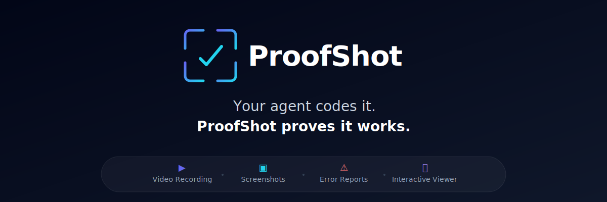

<p align="center">
  
</p>

<p align="center">
  <strong>The open-source, agent-agnostic CLI that gives AI coding agents eyes.</strong>
</p>

Your agent builds a feature — ProofShot records video proof it works. Three commands. Any agent. Real browser verification.

Works with: Claude Code, Codex, Cursor, Gemini CLI, GitHub Copilot, Windsurf, and any agent that runs shell commands.

## Why ProofShot?

AI coding agents build UI features blind. They write code but can't verify the result. Cursor shipped video review for their cloud agents — but it's locked into Cursor's ecosystem. QA tools like TestDriver and TestZeus capture browser sessions — but they're built for test automation, not for closing the coding agent feedback loop.

**ProofShot is the missing piece:** an open-source CLI that plugs into *any* AI coding agent and gives it a verification workflow — test in a real browser, record video proof, collect errors, and bundle everything for the human to review. No vendor lock-in. No cloud dependency. Just `npm install -g proofshot` and your agent can see.

The human gets: a video recording showing what was tested, screenshots of key moments, and a report of any console or server errors found.

## Install

```bash
npm install -g proofshot
proofshot install
```

The first command installs the CLI and `agent-browser` (with headless Chromium). The second detects your AI coding tools (Claude Code, Cursor, Codex, Gemini CLI, Windsurf) and installs the ProofShot skill at the user level — so it works across all your projects automatically.

## How It Works

ProofShot uses a **start / test / stop** workflow:

```bash
# 1. Start — browser, recording, error capture (--run starts and captures your dev server)
proofshot start --run "npm run dev" --port 3000 --description "Login form: fill credentials, submit, verify redirect"

# 2. Test — the AI agent drives the browser
agent-browser snapshot -i                                    # See interactive elements
agent-browser open http://localhost:3000/login               # Navigate
agent-browser fill @e2 "test@example.com"                    # Fill form
agent-browser click @e5                                      # Click submit
agent-browser screenshot ./proofshot-artifacts/step-login.png # Capture proof

# 3. Stop — bundle video + screenshots + errors into proof artifacts
proofshot stop
```

You get: a video recording, screenshots, console errors, server errors, and a markdown summary — all in `./proofshot-artifacts/`.

The skill file teaches the agent this workflow automatically. The user just says "verify this with proofshot" and the agent handles the rest.

## Commands

### `proofshot install`

Detects AI coding tools on your machine and installs the ProofShot skill at user level. Run once per machine.

```bash
proofshot install               # Interactive: select which tools to install for
proofshot install --only claude  # Only install for specific tools
proofshot install --skip cursor  # Skip specific tools
proofshot install --force        # Overwrite even if already installed
```

### `proofshot start`

Start a verification session: browser, recording, error capture.

```bash
proofshot start                                                          # Server already running
proofshot start --run "npm run dev" --port 3000                          # Start and capture server
proofshot start --run "npm run dev" --port 3000 --description "what"     # With description for report
proofshot start --url http://localhost:3000/login                        # Open specific URL
proofshot start --port 3001                                              # Custom port
proofshot start --headed                                                 # Show browser window
```

### `proofshot stop`

Stop session: stop recording, collect errors, bundle proof artifacts, generate summary.

```bash
proofshot stop                   # Stop and close browser
proofshot stop --no-close        # Stop but keep browser open
```

### `proofshot diff`

Compare current screenshots against baseline.

```bash
proofshot diff --baseline ./previous-artifacts
```

### `proofshot pr`

Format artifacts as a GitHub PR description snippet.

```bash
proofshot pr                    # Output to stdout
proofshot pr >> pr-body.md      # Append to file
```

### `proofshot clean`

Remove artifact files.

```bash
proofshot clean
```

## Supported Agents

`proofshot install` detects and installs skills for:

- **Claude Code** — `~/.claude/skills/proofshot/SKILL.md`
- **Cursor** — `~/.cursor/rules/proofshot.mdc`
- **Codex (OpenAI)** — `~/.codex/skills/proofshot/SKILL.md`
- **Gemini CLI** — appends to `~/.gemini/GEMINI.md`
- **Windsurf** — appends to `~/.codeium/windsurf/memories/global_rules.md`

All skills are installed at the **user level** — works across every project without per-project setup.

## Try It — Sample App

The repo includes a sample Vite app (`test/fixtures/sample-app/`) so you can see ProofShot in action without setting up your own project.

### 1. Clone and build

```bash
git clone https://github.com/proofshot/proofshot.git
cd proofshot
npm install
npm run build
npm link                    # makes `proofshot` available globally
```

### 2. Set up the sample app

```bash
cd test/fixtures/sample-app
npm install
```

### 3. Tell your AI agent to verify it

Open your AI agent (Claude Code, Cursor, etc.) in the `test/fixtures/sample-app/` directory and give it a prompt like:

> Verify the Acme SaaS sample app with proofshot. Start on the homepage, check the hero section and scroll down to see the feature cards and stats. Then navigate to the Dashboard and check the metrics and activity table. Finally go to Settings, update the profile name to "John Smith" and email to "john@acme.com", toggle on the Marketing emails and SMS alerts switches, and click Save Profile. Screenshot each page and every key interaction.

The agent reads the skill file installed by `proofshot install`, runs the full `start → exec → stop` workflow autonomously, and produces the proof artifacts.

### 4. Check the output

After the agent finishes, open `proofshot-artifacts/` to find:

- `session.webm` — video recording of the entire session
- `step-*.png` — screenshots at key moments
- `SUMMARY.md` — markdown report with errors and screenshots
- `viewer.html` — standalone HTML viewer (open in your browser)

### Alternative: run the automated test script

If you just want to see the CLI work end-to-end without an AI agent:

```bash
cd test/fixtures/sample-app
bash test-proofshot.sh
```

This runs the full lifecycle: `start → browser interactions → stop → pr → clean`.

Built on [agent-browser](https://github.com/vercel-labs/agent-browser) by Vercel.

## Test Fixture Apps

Three sample apps are included for testing ProofShot end-to-end. Each covers different UI patterns an agent might encounter.

### sample-app — `localhost:cafe` (port 5173)

A SaaS landing page with navigation, dashboard metrics, settings forms, and toggle switches.

```bash
cd test/fixtures/sample-app && npm install && npm run dev
```

**Test prompts:**

```
Verify the localhost:cafe homepage loads, navigate to the dashboard, confirm the status
bar shows "All systems nominal", then go to settings and toggle off "Deploy notifications".
Take a screenshot of each page.
```

```
Navigate to the settings page, change the display name to "Grace Hopper", select the
"Solarized" theme, toggle on "Weekend deploy alerts", and click Save Profile. Screenshot
each step.
```

```
Visit all three pages (home, dashboard, settings) and verify there are no console errors.
On the dashboard, confirm the activity table has 5 rows. Screenshot the final state.
```

### todo-app — `ship.log` (port 5174)

A kanban board with drag-and-drop, right-click context menus, inline editing, keyboard shortcuts, and subtask checkboxes.

```bash
cd test/fixtures/todo-app && npm install && npm run dev
```

**Test prompts:**

```
Open the kanban board. Drag the task "Fix bug that only happens on Fridays" from Backlog
to In Progress. Then right-click on "Rewrite everything in Rust" and select "Archive".
Create a new task called "Deploy v2.0" with priority P0 in the Backlog column. Screenshot
the board after each action.
```

```
Use the search bar to filter tasks containing "debug". Verify only matching cards are
visible. Press Escape to clear the search. Then double-click the title of any task to
rename it to "Ship it now". Screenshot the results.
```

```
Press "n" to open the new task modal. Fill in title "Write migration script", set priority
to P1 and label to "tech-debt", assign it to In Progress. Submit and verify the card
appears. Then navigate to the archive page and confirm shipped task stats are displayed.
```

### chat-app — `devnull.chat` (port 5175)

A messaging interface with channel switching, emoji picker, message reactions, file drag-and-drop, threaded replies, toast notifications, and collapsible accordions.

```bash
cd test/fixtures/chat-app && npm install && npm run dev
```

**Test prompts:**

```
Open the chat app. Switch to the #incidents channel and read the messages. Click the
reaction button on any message to add a thumbs-up. Then switch to #general, type
"Deploying hotfix now" in the message input, and press Enter to send. Verify the toast
notification appears. Screenshot each step.
```

```
Click the emoji picker button, select an emoji, and verify it's inserted into the message
input. Then click the file attach button and attach a file. Verify the attachment indicator
appears. Toggle the markdown preview on and type "**bold text**" to confirm rendering.
Screenshot the final state.
```

```
Expand the threaded reply on a message in #general. Verify sub-messages are visible. Then
navigate to the profile page, change the display name to "root", set status to DND, expand
the "Appearance" accordion, and adjust the font size slider. Screenshot each interaction.
```

## License

MIT
